# Flowtron对比实验

## 语音变化程度控制对比实验

### 合成样例展示

| **Model** |      **Condition**      |                          **Audio**                           |                     **Mel-spectrogram**                      |
| :-------: | :---------------------: | :----------------------------------------------------------: | :----------------------------------------------------------: |
| Flowtron  |      *sigma = 0.0*      | <audio controls><source src="./data/experiment1/Audio/flowtron_0.0.wav" type="audio/wav">Your browser does not support the audio element.</audio> | 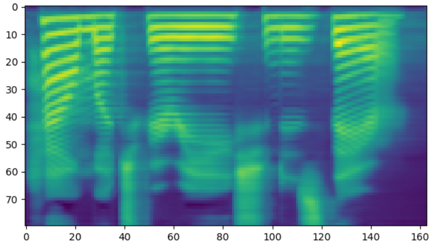 |
| Flowtron  |      *sigma = 0.5*      | <audio controls><source src="./data/experiment1/Audio/flowtron_0.5.wav" type="audio/wav">Your browser does not support the audio element.</audio> |  |
| Flowtron  |      *sigma = 1.0*      | <audio controls><source src="./data/experiment1/Audio/flowtron.wav" type="audio/wav">Your browser does not support the audio element.</audio> | 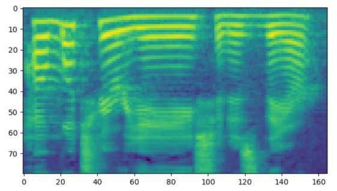 |
| Tacotron2 | *p in {0.45,0.5,0.55 }* | <audio controls><source src="./data/experiment1/Audio/tacotron2.wav" type="audio/wav">Your browser does not support the audio element.</audio> | 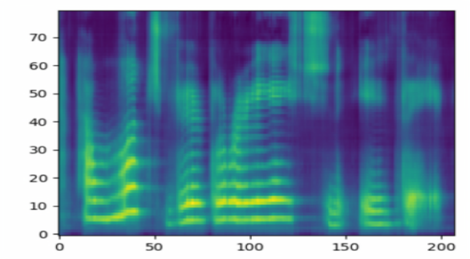 |

### **F0 Contours对比图**

|                       **F0 Contours**                        |
| :----------------------------------------------------------: |
| **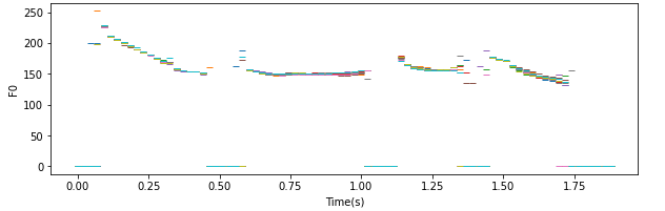** |
|                   *Flowtron   sigma = 0.0*                   |
| **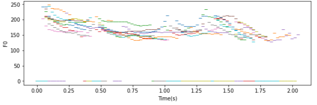** |
|                   *Flowtron   sigma = 0.5*                   |
| **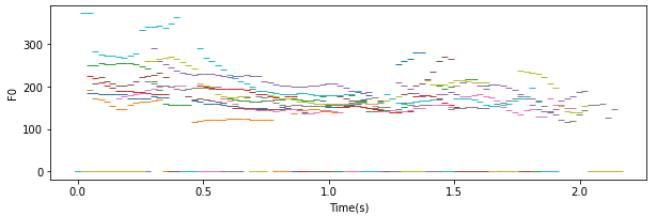** |
|                   *Flowtron  sigma = 1.0*                    |
| **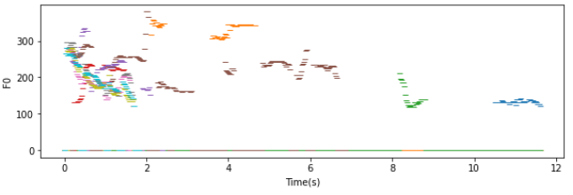** |
|              *Tacotron2  p in {0.45,0.5,0.55 }*              |

## **样本间插值实验**

| **Case**  |                         **Gaussian**                         |                     **Mel-spectrogram**                      |                          **Audio**                           |
| :-------: | :----------------------------------------------------------: | :----------------------------------------------------------: | :----------------------------------------------------------: |
| sample 1  | **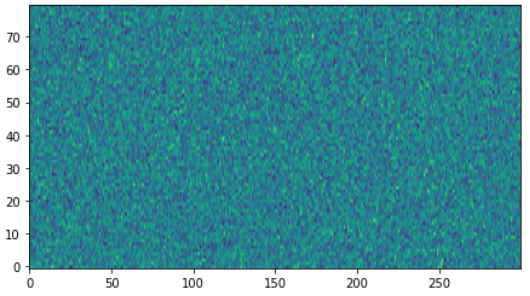** | **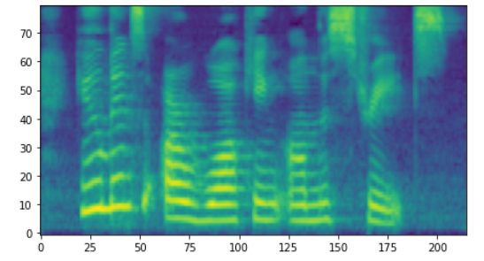** | <audio controls><source src="./data/experiment2/Audio/0.wav" type="audio/wav">Your browser does not support the audio element.</audio> |
| step = 25 | **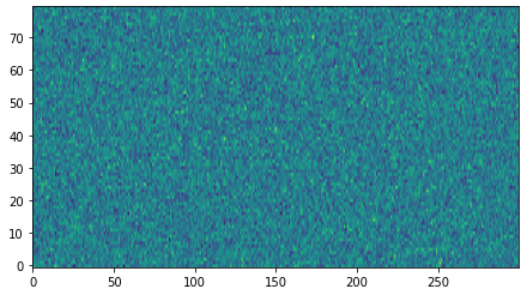** | **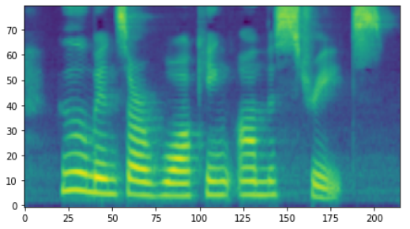** | <audio controls><source src="./data/experiment2/Audio/25.wav" type="audio/wav">Your browser does not support the audio element.</audio> |
| step = 75 | **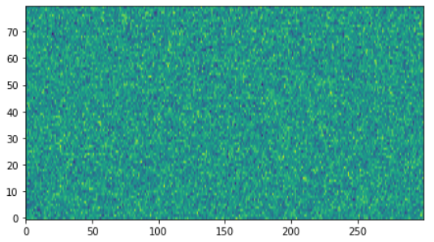** | **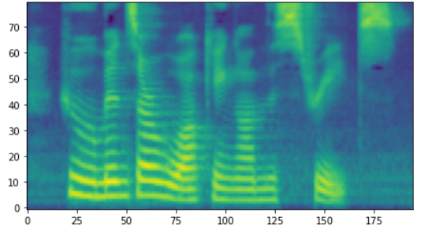** | <audio controls><source src="./data/experiment2/Audio/75.wav" type="audio/wav">Your browser does not support the audio element.</audio> |
| sample 2  | **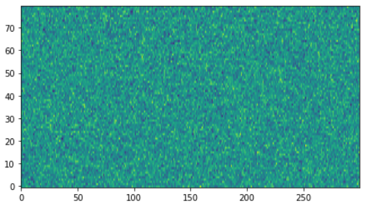** | **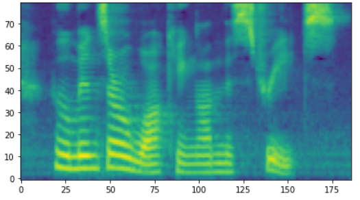** | <audio controls><source src="./data/experiment2/Audio/100.wav" type="audio/wav">Your browser does not support the audio element.</audio> |

## **说话人之间风格转换实验**

|        **Case**        |                          **Image**                           |                          **Audio**                           |
| :--------------------: | :----------------------------------------------------------: | :----------------------------------------------------------: |
|        参考音频        | **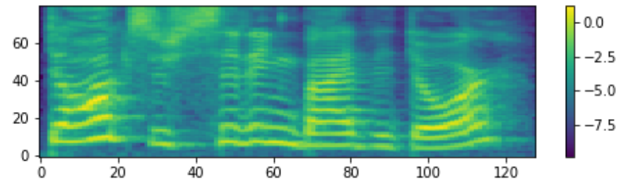** | <audio controls><source src="./data/experiment3/Audio/reference.wav" type="audio/wav">Your browser does not support the audio element.</audio> |
| Flowtron随机采样的语音 | **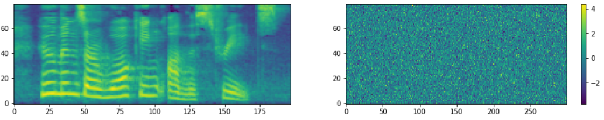** | <audio controls><source src="./data/experiment3/Audio/normal.wav" type="audio/wav">Your browser does not support the audio element.</audio> |
| Flowtron风格转换的语音 | **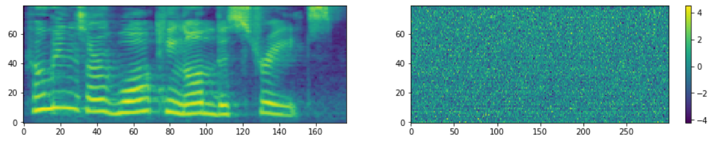** | <audio controls><source src="./data/experiment3/Audio/GST_Tacotron.wav" type="audio/wav">Your browser does not support the audio element.</audio> |
|   GSTs风格转换的语音   | **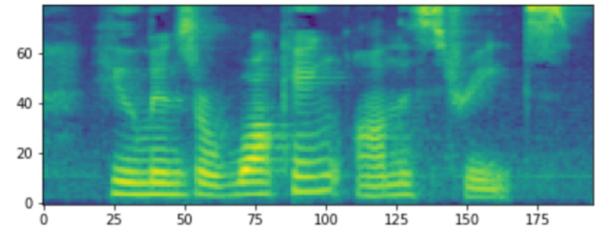** | <audio controls><source src="./data/experiment3/Audio/transfer.wav" type="audio/wav">Your browser does not support the audio element.</audio> |

