# FullSubNet++: Speech Enhancement with Subband Communication

### *Jun Chen, Wei Rao, Zilin Wang, Zhiyong Wu, Yannan Wang,  Tao Yu, Shidong Shang, Helen Meng*

<h2 id = "1">Abstract</h2>

FullSubNet+ has achieved outstanding performance on Deep Noise Suppression (DNS) Challenge - Interspeech 2021 dataset. However, it does not explicitly model the cross-band dependencies which are important parts of the global spectral information. To this end, this paper firstly introduces the subband communication by a interactive subband model to learn cross-band dependencies and proposes an improved single-channel speech enhancement framework called FullSubNet++. Experimental results on DNS Challenge - Interspeech 2021 dataset show that the proposed FullSubNet++ outperforms FullSubNet+ and other state-of-the-art speech enhancement approaches, and demonstrate the effectiveness of subband communication.

## With Reverberation

<h3 id = "3"> case 1</h3>

|                          **case 1**                          |                                                              |
| :----------------------------------------------------------: | :----------------------------------------------------------: |
| **Noisy**  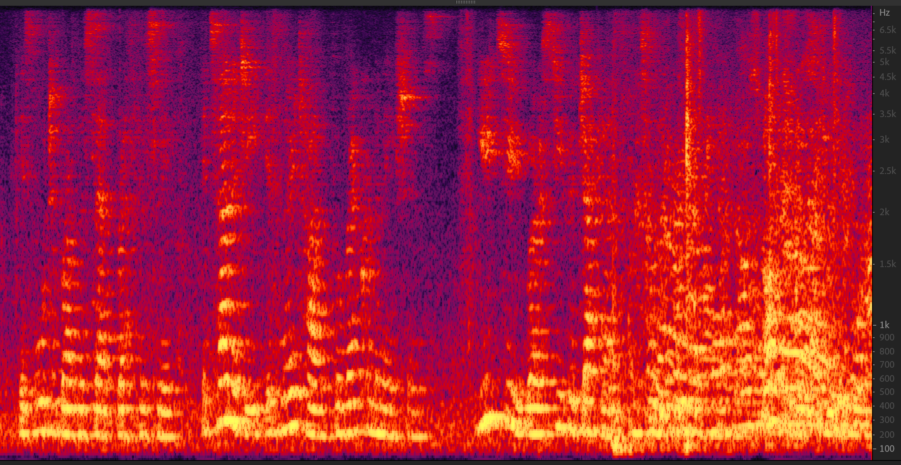 | **FullSubNet+**  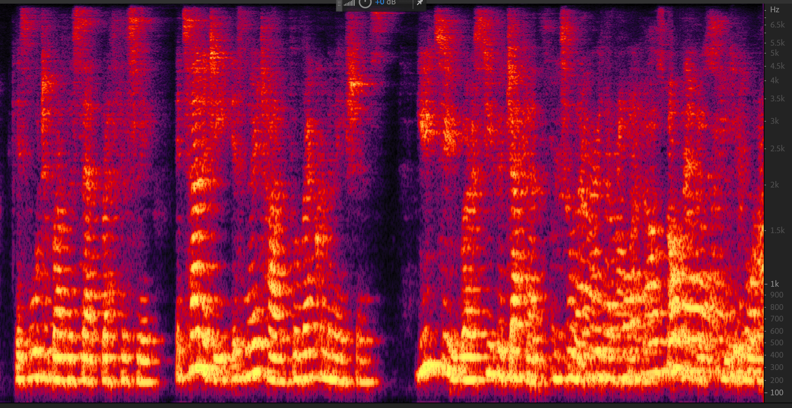 |
| <audio controls><source src="./data/with_reverb/example275/noisy.wav" type="audio/wav">Your browser does not support the audio element.</audio> | <audio controls><source src="./data/with_reverb/example275/fullsubnet+.wav" type="audio/wav">Your browser does not support the audio element.</audio> |
| **FullSubNet++**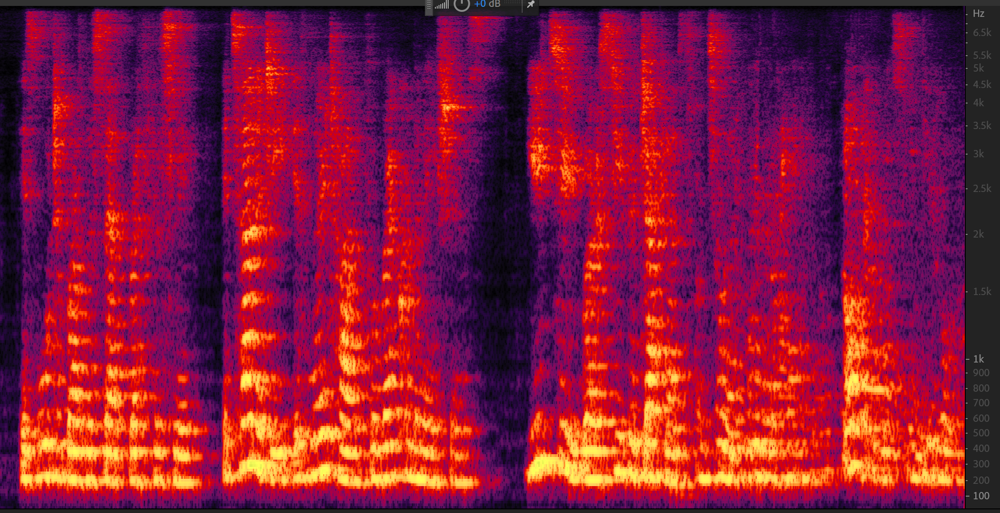 | **Clean**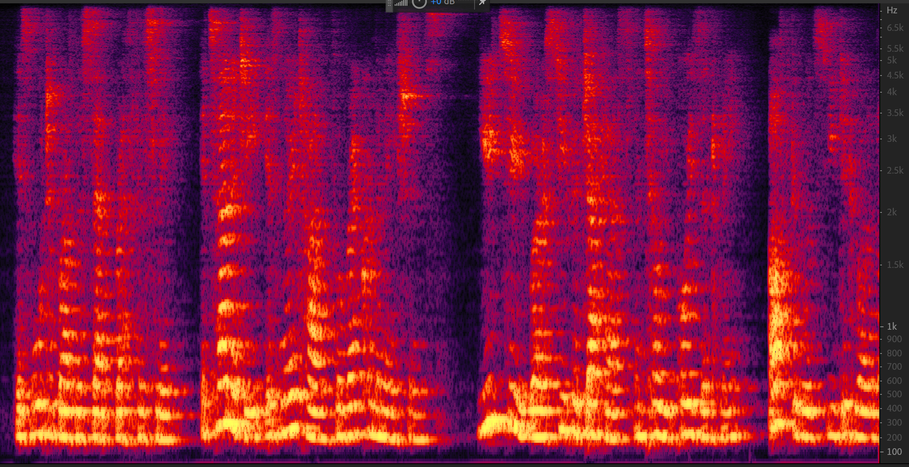 |
| <audio controls><source src="./data/with_reverb/example275/fullsubnet++.wav" type="audio/wav">Your browser does not support the audio element.</audio> | <audio controls><source src="./data/with_reverb/example275/clean.wav" type="audio/wav">Your browser does not support the audio element.</audio> |

<h3 id = "3"> case 2</h3>

|                          **case 2**                          |                                                              |
| :----------------------------------------------------------: | :----------------------------------------------------------: |
|                          **Noisy**                           |                       **FullSubNet+**                        |
| **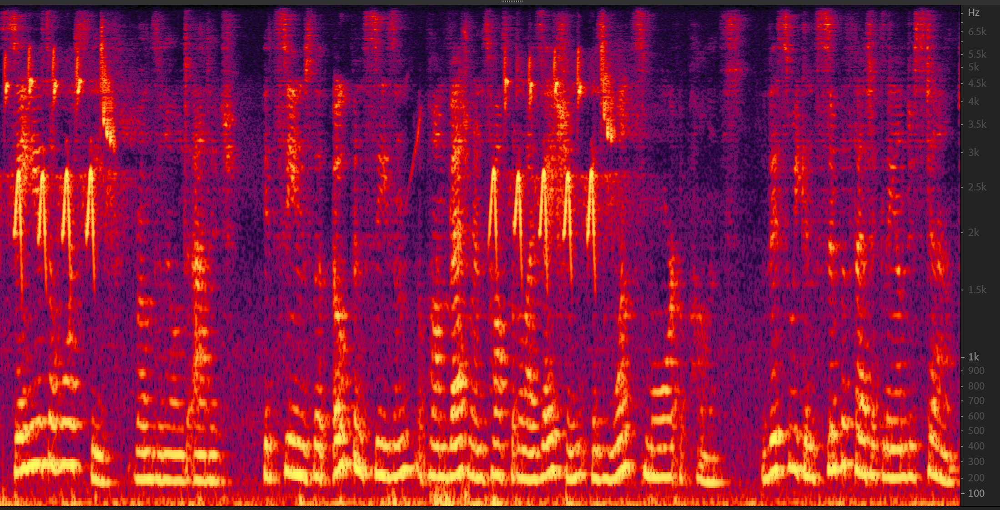** | 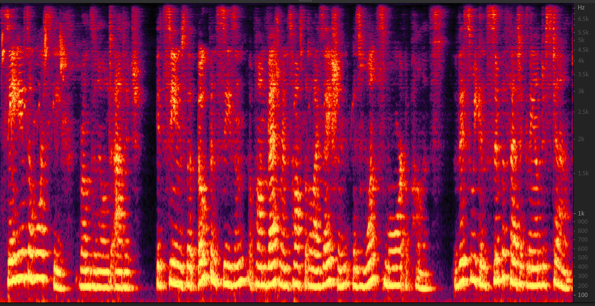 |
| <audio controls><source src="./data/with_reverb/example291/noisy.wav" type="audio/wav">Your browser does not support the audio element.</audio> | <audio controls><source src="./data/with_reverb/example291/fullsubnet+.wav" type="audio/wav">Your browser does not support the audio element.</audio> |
|                       **FullSubNet++**                       |                          **Clean**                           |
| **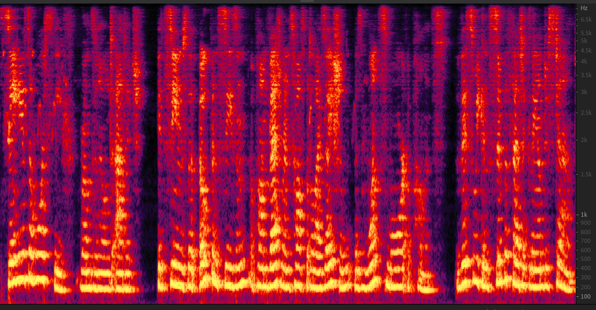** | **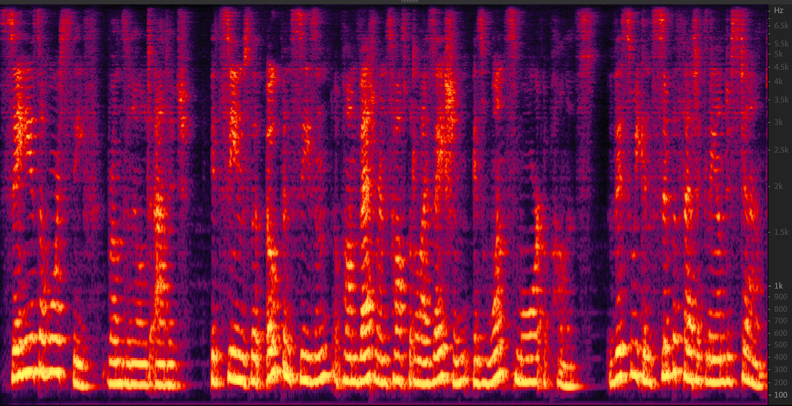** |
| <audio controls><source src="./data/with_reverb/example291/fullsubnet++.wav" type="audio/wav">Your browser does not support the audio element.</audio> | <audio controls><source src="./data/with_reverb/example291/clean.wav" type="audio/wav">Your browser does not support the audio element.</audio> |

<h3 id = "3"> case 3</h3>

|                          **case 3**                          |                                                              |
| :----------------------------------------------------------: | :----------------------------------------------------------: |
|                          **Noisy**                           |                       **FullSubNet+**                        |
| **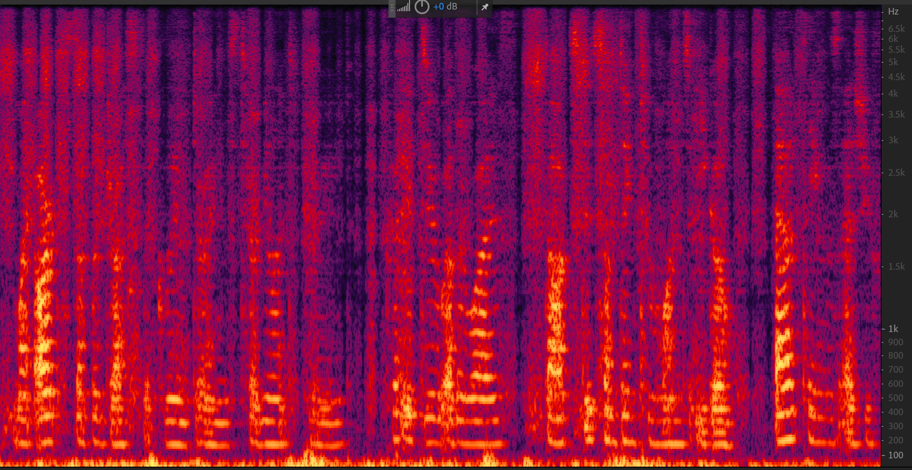** | 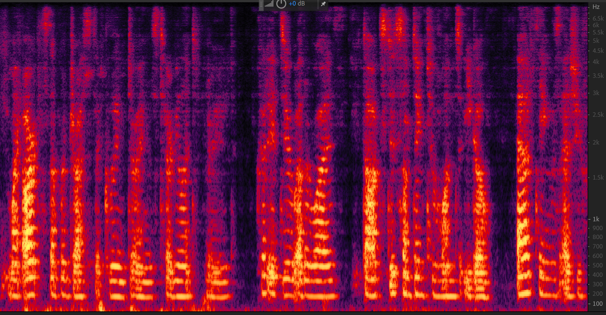 |
| <audio controls><source src="./data/with_reverb/example5/noisy.wav" type="audio/wav">Your browser does not support the audio element.</audio> | <audio controls><source src="./data/with_reverb/example5/fullsubnet+.wav" type="audio/wav">Your browser does not support the audio element.</audio> |
|                       **FullSubNet++**                       |                          **Clean**                           |
| **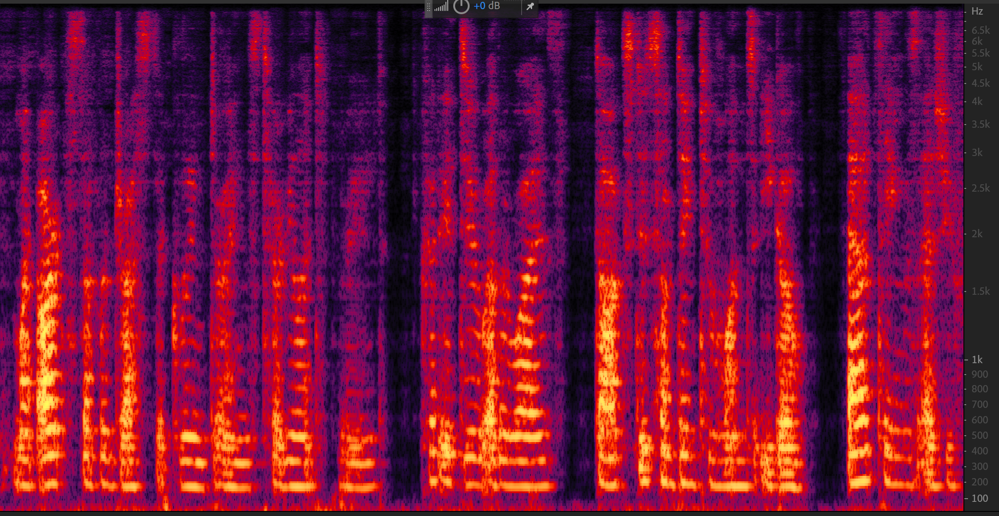** | **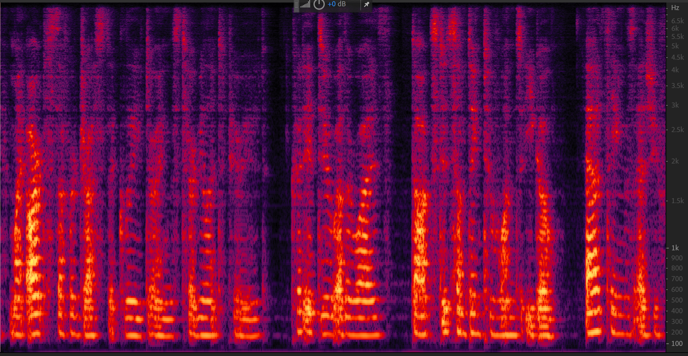** |
| <audio controls><source src="./data/with_reverb/example5/fullsubnet++.wav" type="audio/wav">Your browser does not support the audio element.</audio> | <audio controls><source src="./data/with_reverb/example5/clean.wav" type="audio/wav">Your browser does not support the audio element.</audio> |

<h3 id = "3"> case 4</h3>

|                          **case 4**                          |                                                              |
| :----------------------------------------------------------: | :----------------------------------------------------------: |
|                          **Noisy**                           |                       **FullSubNet+**                        |
| **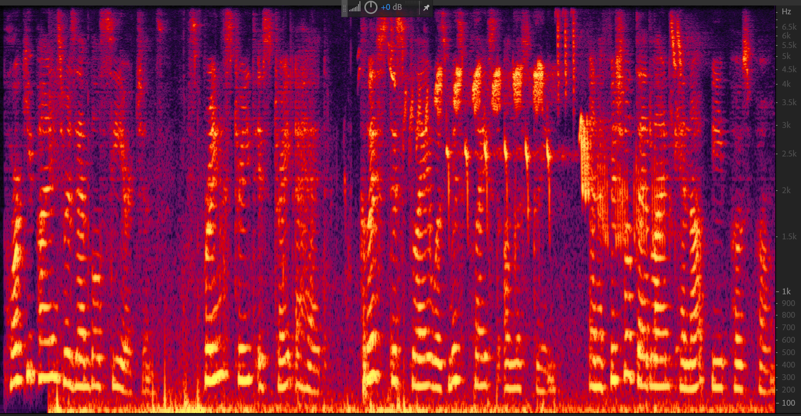** | 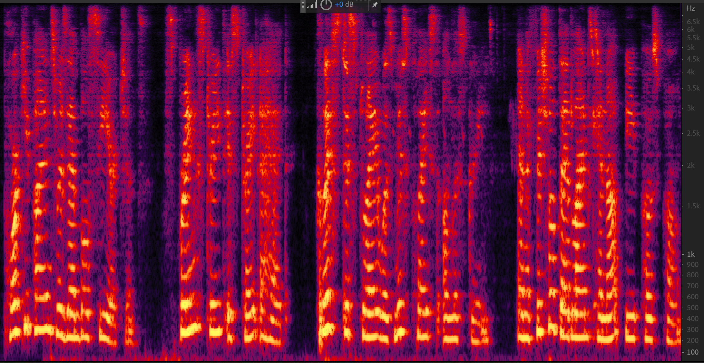 |
| <audio controls><source src="./data/with_reverb/example63/noisy.wav" type="audio/wav">Your browser does not support the audio element.</audio> | <audio controls><source src="./data/with_reverb/example63/fullsubnet+.wav" type="audio/wav">Your browser does not support the audio element.</audio> |
|                       **FullSubNet++**                       |                          **Clean**                           |
| **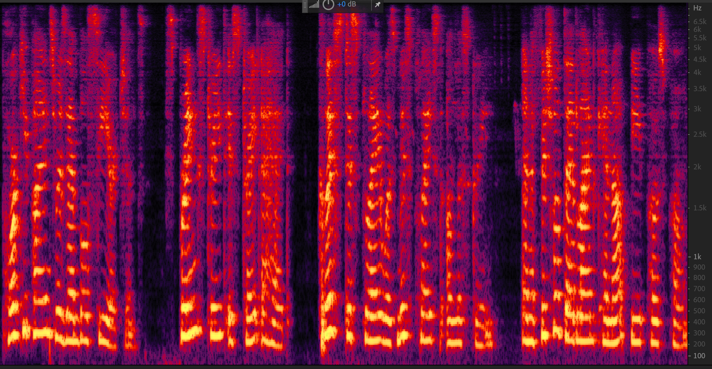** | **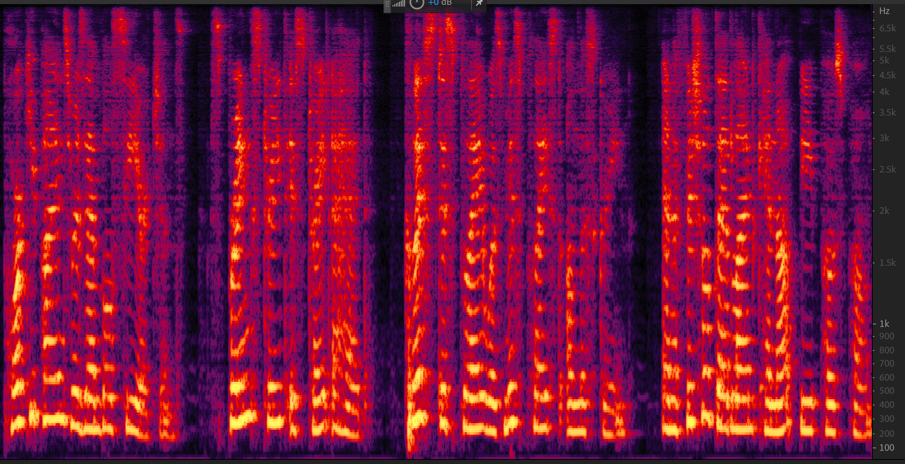** |
| <audio controls><source src="./data/with_reverb/example63/fullsubnet++.wav" type="audio/wav">Your browser does not support the audio element.</audio> | <audio controls><source src="./data/with_reverb/example63/clean.wav" type="audio/wav">Your browser does not support the audio element.</audio> |

## Without Reverberation

<h3 id = "3"> case 1</h3>

|                          **case 1**                          |                                                              |
| :----------------------------------------------------------: | :----------------------------------------------------------: |
|                          **Noisy**                           |                       **FullSubNet+**                        |
| **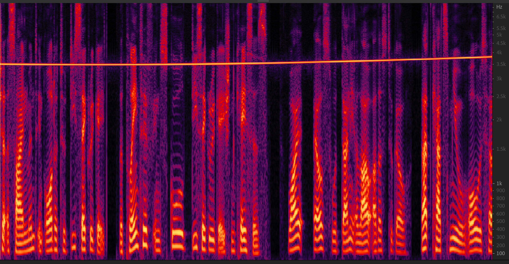** | 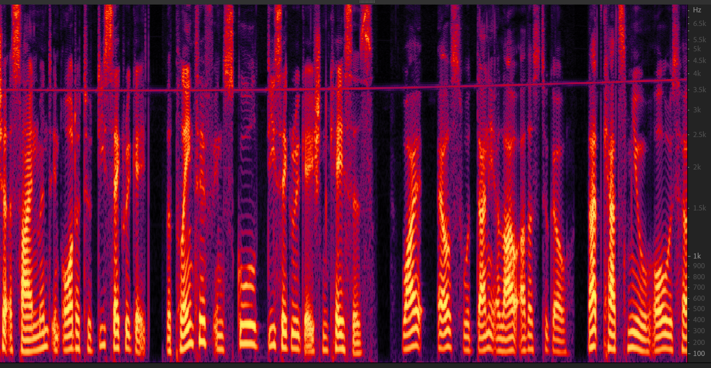 |
| <audio controls><source src="./data/no_reverb/example112/noisy.wav" type="audio/wav">Your browser does not support the audio element.</audio> | <audio controls><source src="./data/no_reverb/example112/fullsubnet+.wav" type="audio/wav">Your browser does not support the audio element.</audio> |
|                       **FullSubNet++**                       |                          **Clean**                           |
| **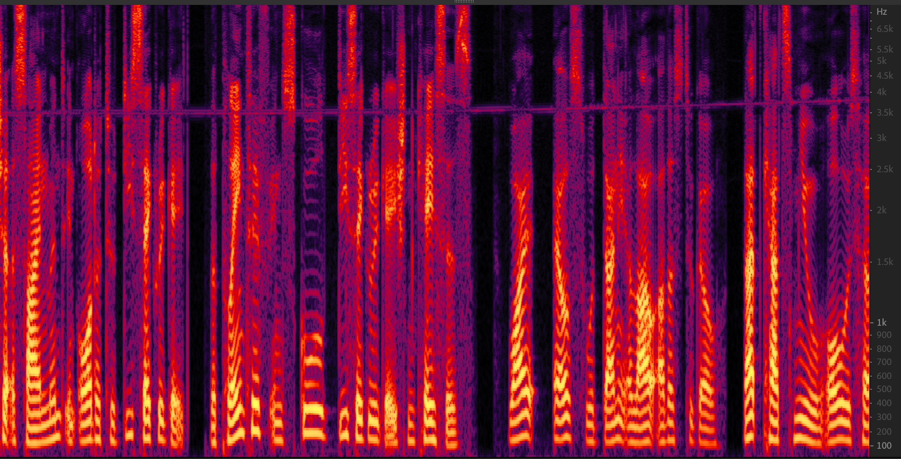** | **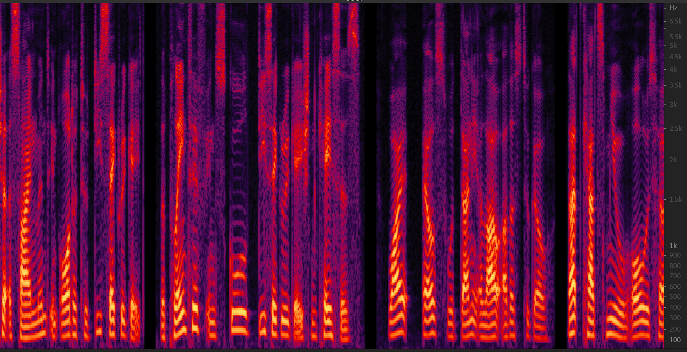** |
| <audio controls><source src="./data/no_reverb/example112/fullsubnet++.wav" type="audio/wav">Your browser does not support the audio element.</audio> | <audio controls><source src="./data/no_reverb/example112/clean.wav" type="audio/wav">Your browser does not support the audio element.</audio> |

<h3 id = "3"> case 2</h3>

|                          **case 2**                          |                                                              |
| :----------------------------------------------------------: | :----------------------------------------------------------: |
|                          **Noisy**                           |                       **FullSubNet+**                        |
| **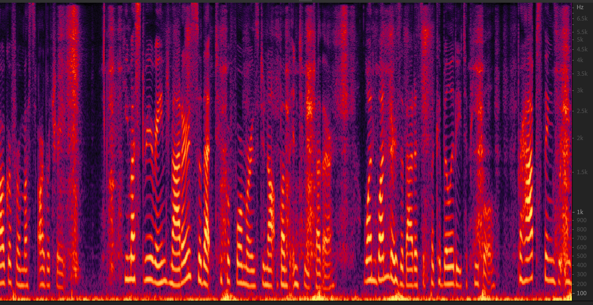** | 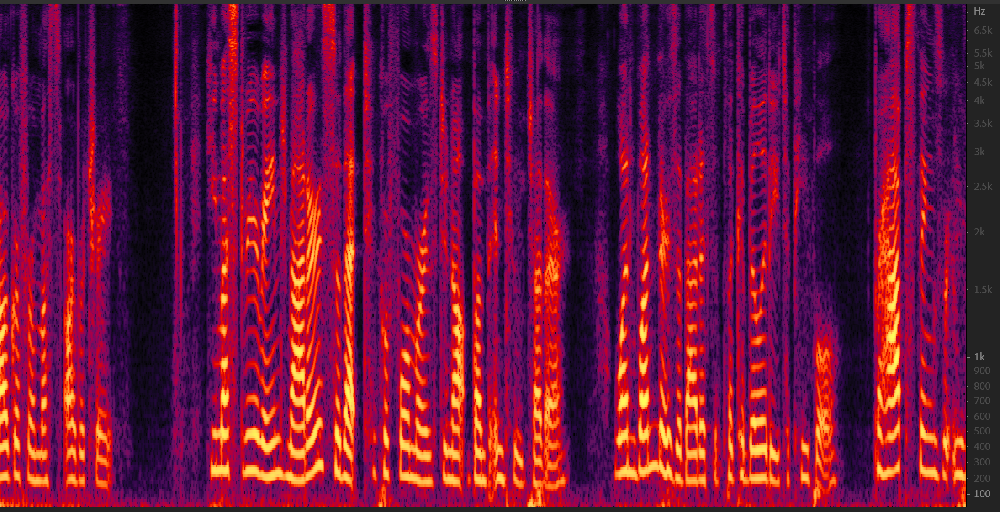 |
| <audio controls><source src="./data/no_reverb/example163/noisy.wav" type="audio/wav">Your browser does not support the audio element.</audio> | <audio controls><source src="./data/no_reverb/example163/fullsubnet+.wav" type="audio/wav">Your browser does not support the audio element.</audio> |
|                       **FullSubNet++**                       |                          **Clean**                           |
| **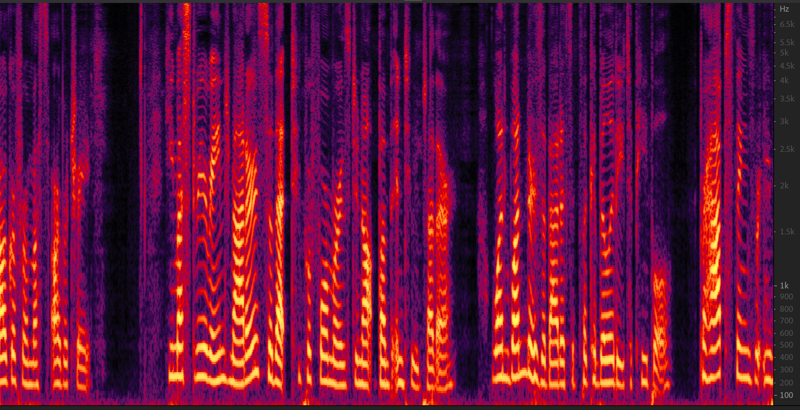** | **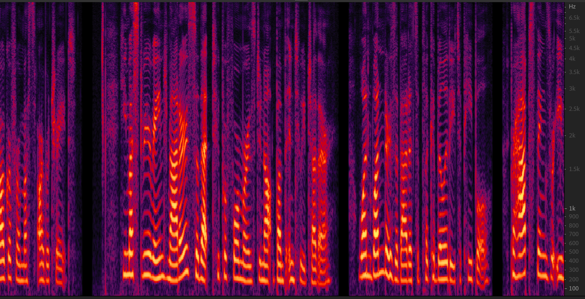** |
| <audio controls><source src="./data/no_reverb/example163/fullsubnet++.wav" type="audio/wav">Your browser does not support the audio element.</audio> | <audio controls><source src="./data/no_reverb/example163/clean.wav" type="audio/wav">Your browser does not support the audio element.</audio> |

<h3 id = "3"> case 3</h3>

|                          **case 3**                          |                                                              |
| :----------------------------------------------------------: | :----------------------------------------------------------: |
|                          **Noisy**                           |                       **FullSubNet+**                        |
| **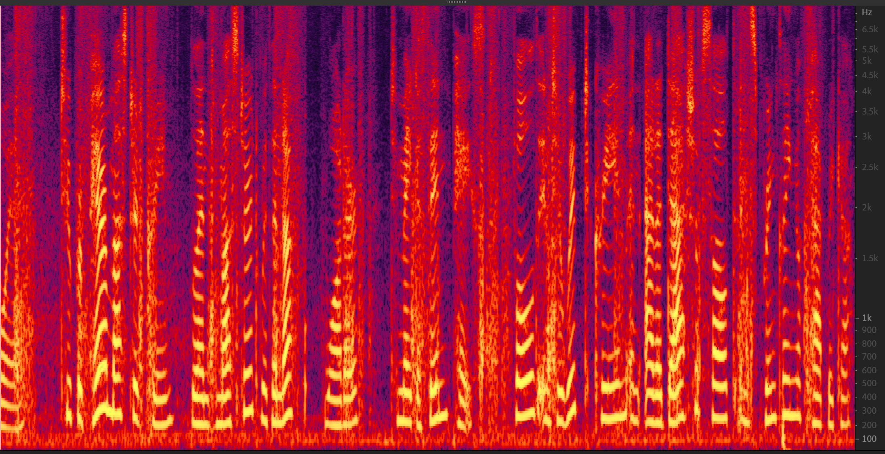** | 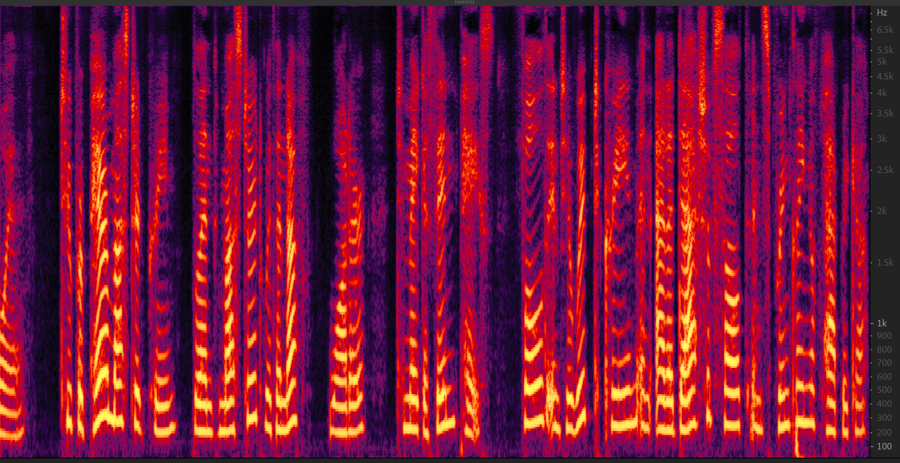 |
| <audio controls><source src="./data/no_reverb/example82/noisy.wav" type="audio/wav">Your browser does not support the audio element.</audio> | <audio controls><source src="./data/no_reverb/example82/fullsubnet+.wav" type="audio/wav">Your browser does not support the audio element.</audio> |
|                       **FullSubNet++**                       |                          **Clean**                           |
| **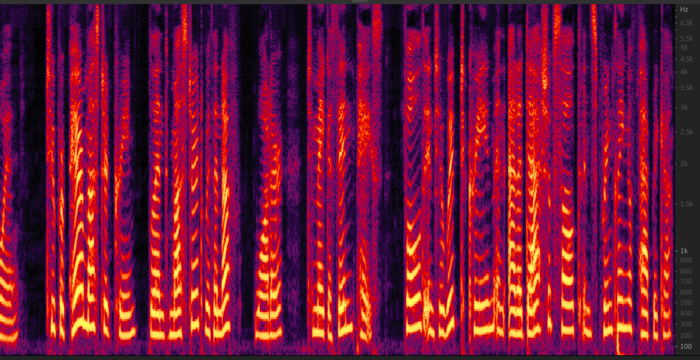** | **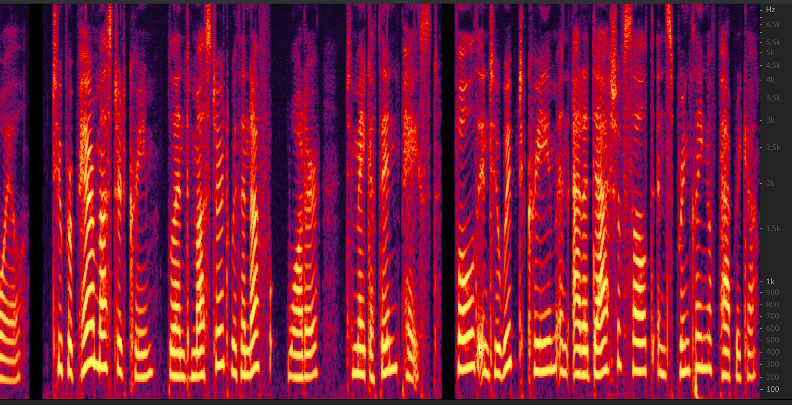** |
| <audio controls><source src="./data/no_reverb/example82/fullsubnet++.wav" type="audio/wav">Your browser does not support the audio element.</audio> | <audio controls><source src="./data/no_reverb/example82/clean.wav" type="audio/wav">Your browser does not support the audio element.</audio> |

<h3 id = "3"> case 4</h3>

|                          **case 4**                          |                                                              |
| :----------------------------------------------------------: | :----------------------------------------------------------: |
|                          **Noisy**                           |                       **FullSubNet+**                        |
| **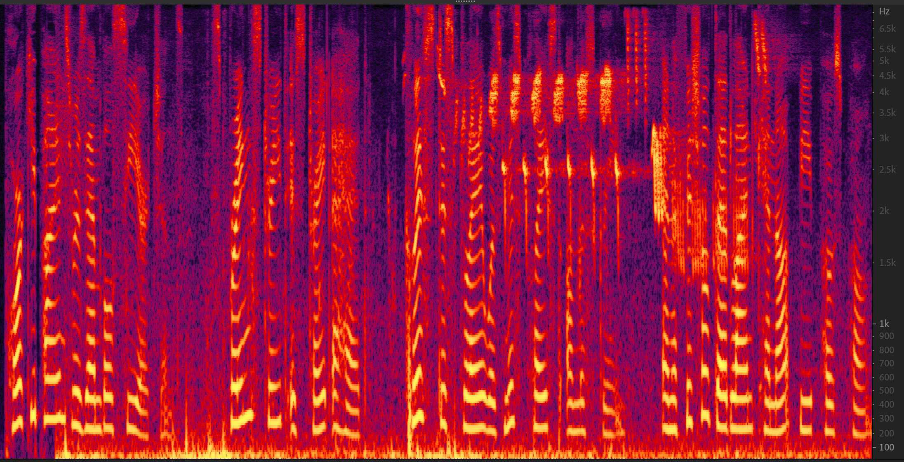** | 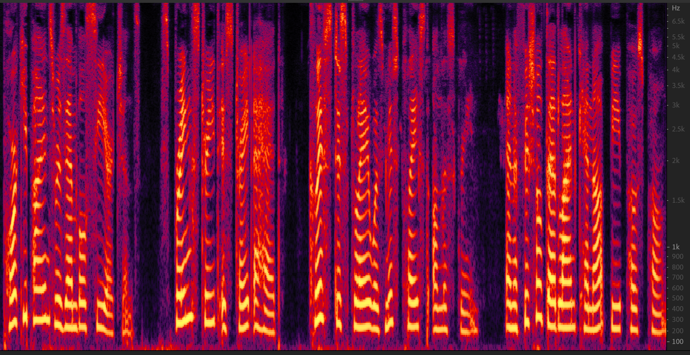 |
| <audio controls><source src="./data/no_reverb/example63/noisy.wav" type="audio/wav">Your browser does not support the audio element.</audio> | <audio controls><source src="./data/no_reverb/example63/fullsubnet+.wav" type="audio/wav">Your browser does not support the audio element.</audio> |
|                       **FullSubNet++**                       |                          **Clean**                           |
| **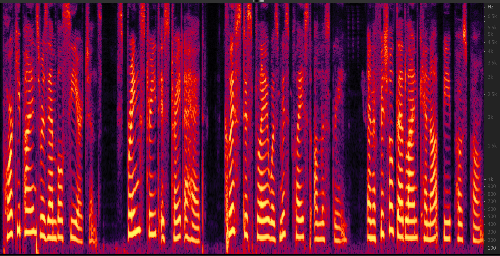** | **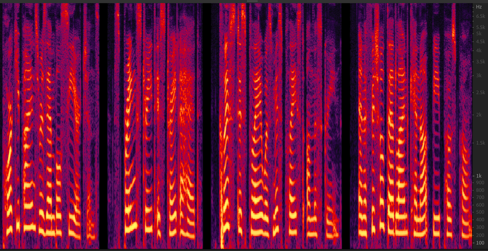** |
| <audio controls><source src="./data/no_reverb/example63/fullsubnet++.wav" type="audio/wav">Your browser does not support the audio element.</audio> | <audio controls><source src="./data/no_reverb/example63/clean.wav" type="audio/wav">Your browser does not support the audio element.</audio> |

