## [Abstract](#1)

## [With Reverberation](#2)

### [case1](#3)

### [case2](#4)

### [case3](#5)

### [case4](#6)

## [Without Reverberation](#7)

### [case1](#8)

### [case2](#9)

### [case3](#10)

### [case4](#11)

<h2 id = "1">Abstract</h2>

Previously proposed FullSubNet has achieved outstanding performance in Deep Noise Suppression (DNS) Challenge and thus received great interests. Unfortunately, it still has shortcomings such as input-output mismatch and coarse processing for frequency band.
In this paper, we propose an extended real-time single-channel speech enhancement framework called FullSubNet+ with following significant improvements. First, to make full use of the phase information in noisy speech, our model takes all the magnitude, real and imaginary spectrograms as inputs. Then, we design a multi-scale time sensitive channel attention (MulCA) module which adopts multi-scale convolution kernel and channel attention mechanism to have different emphases on different frequency bands. Moreover, by replacing the long short-time momery (LSTM) layers in original full-band model with stacked temporal convolutional network (TCN) blocks, we design a more efficient full-band module called full-band extractor. 
The experimental results in DNS Challenge dataset show the superior performance of our FullSubNet, which reach the state-of-the-art performance and outperform other existing speech enhancement approaches.

<h2 id = "2">Without Reverberation</h2>

<h3 id = "3"> case 1</h3>

|                          **case 1**                          |
| :----------------------------------------------------------: |
|                          **Noisy**                           |
| **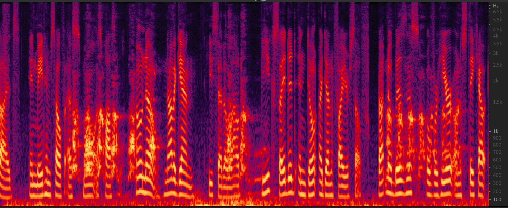** |
| <audio controls><source src="./data/no_reverb/example1/noisy.wav" type="audio/wav">Your browser does not support the audio element.</audio> |
|                        **FullSubNet**                        |
| **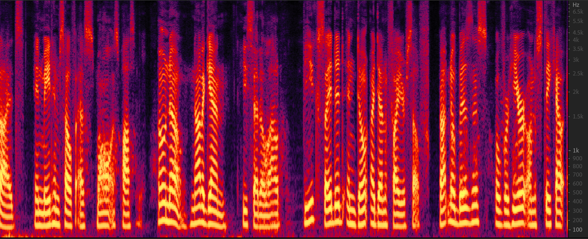** |
| <audio controls><source src="./data/no_reverb/example1/fullsubnet.wav" type="audio/wav">Your browser does not support the audio element.</audio> |
|                       **FullSubNet+**                        |
| **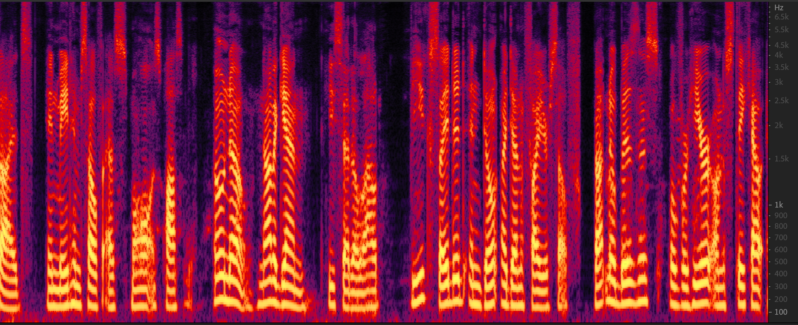** |
| <audio controls><source src="./data/no_reverb/example1/fullsubnet+.wav" type="audio/wav">Your browser does not support the audio element.</audio> |
|                          **Clean**                           |
| **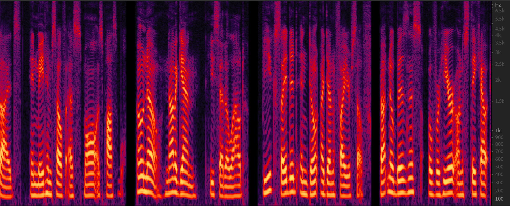** |
| <audio controls><source src="./data/no_reverb/example1/clean.wav" type="audio/wav">Your browser does not support the audio element.</audio> |

<h3 id = "4">case 2</h3>

|                          **case 2**                          |
| :----------------------------------------------------------: |
|                          **Noisy**                           |
| **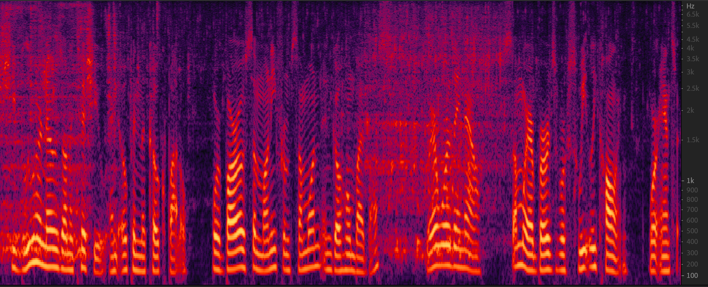** |
| <audio controls><source src="./data/no_reverb/example2/noisy.wav" type="audio/wav">Your browser does not support the audio element.</audio> |
|                        **FullSubNet**                        |
| **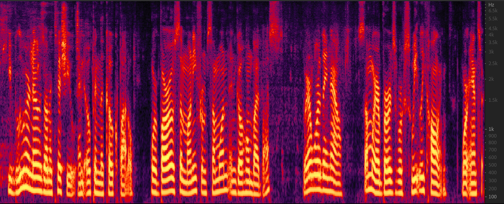** |
| <audio controls><source src="./data/no_reverb/example2/fullsubnet.wav" type="audio/wav">Your browser does not support the audio element.</audio> |
|                       **FullSubNet+**                        |
| **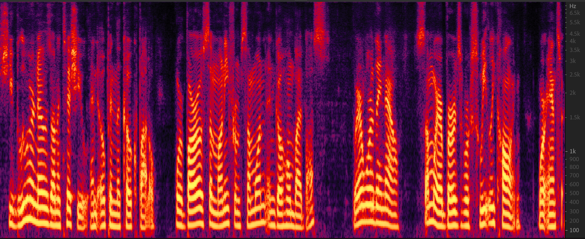** |
| <audio controls><source src="./data/no_reverb/example2/fullsubnet+.wav" type="audio/wav">Your browser does not support the audio element.</audio> |
|                          **Clean**                           |
| **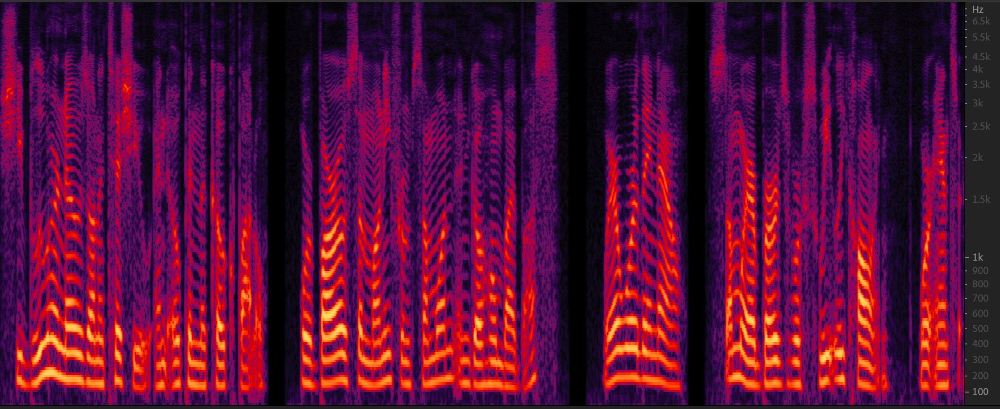** |
| <audio controls><source src="./data/no_reverb/example2/clean.wav" type="audio/wav">Your browser does not support the audio element.</audio> |

<h3 id = "5">case 3</h3>

|                          **case 3**                          |
| :----------------------------------------------------------: |
|                          **Noisy**                           |
| **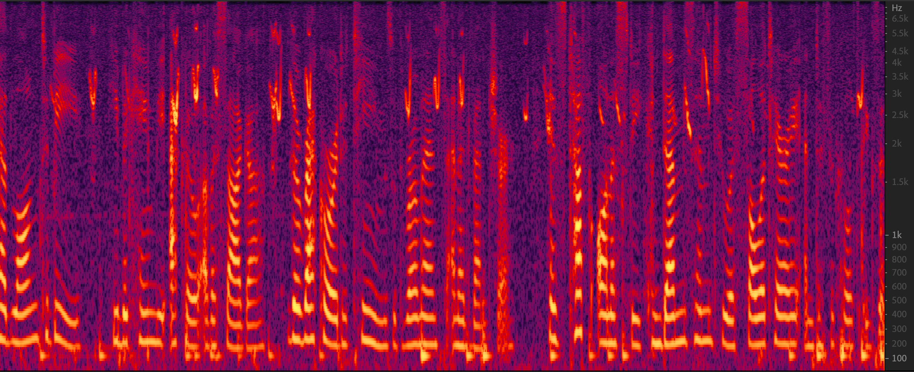** |
| <audio controls><source src="./data/no_reverb/example3/noisy.wav" type="audio/wav">Your browser does not support the audio element.</audio> |
|                        **FullSubNet**                        |
| **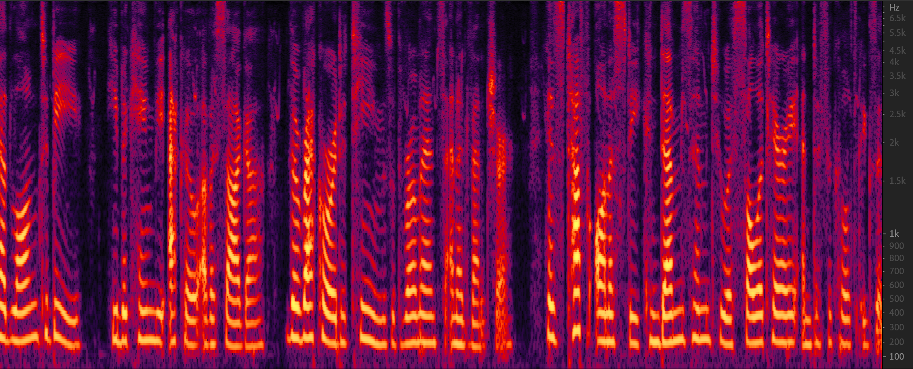** |
| <audio controls><source src="./data/no_reverb/example3/fullsubnet.wav" type="audio/wav">Your browser does not support the audio element.</audio> |
|                       **FullSubNet+**                        |
| **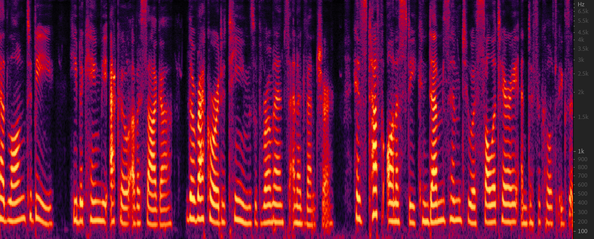** |
| <audio controls><source src="./data/no_reverb/example3/fullsubnet+.wav" type="audio/wav">Your browser does not support the audio element.</audio> |
|                          **Clean**                           |
| **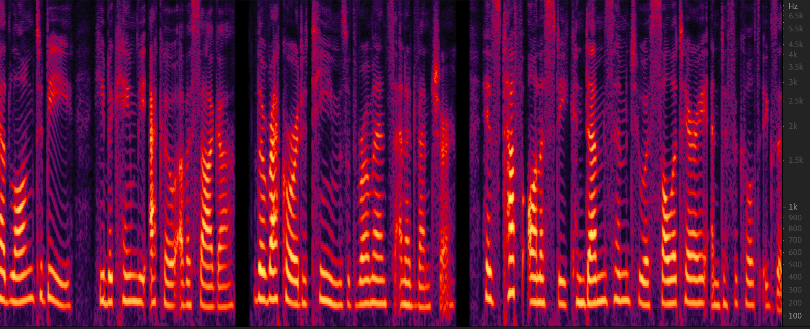** |
| <audio controls><source src="./data/no_reverb/example3/clean.wav" type="audio/wav">Your browser does not support the audio element.</audio> |

<h3 id = "6">case 4</h3>

|                          **case 4**                          |
| :----------------------------------------------------------: |
|                          **Noisy**                           |
| **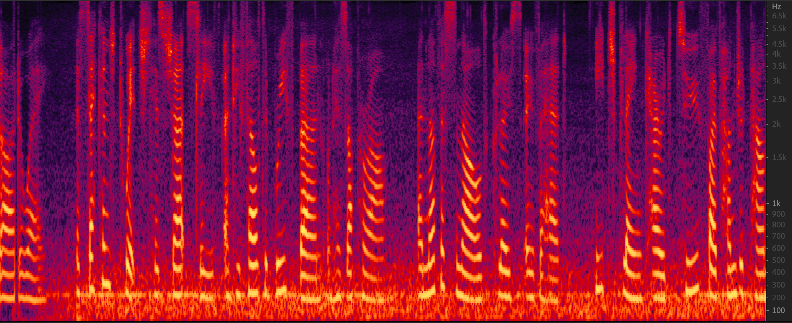** |
| <audio controls><source src="./data/no_reverb/example4/noisy.wav" type="audio/wav">Your browser does not support the audio element.</audio> |
|                        **FullSubNet**                        |
| **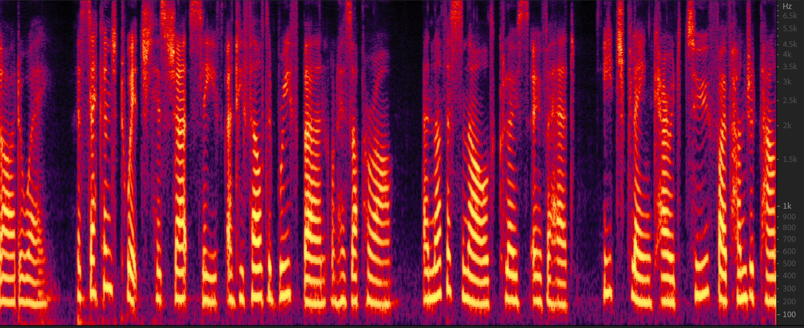** |
| <audio controls><source src="./data/no_reverb/example4/fullsubnet.wav" type="audio/wav">Your browser does not support the audio element.</audio> |
|                       **FullSubNet+**                        |
| **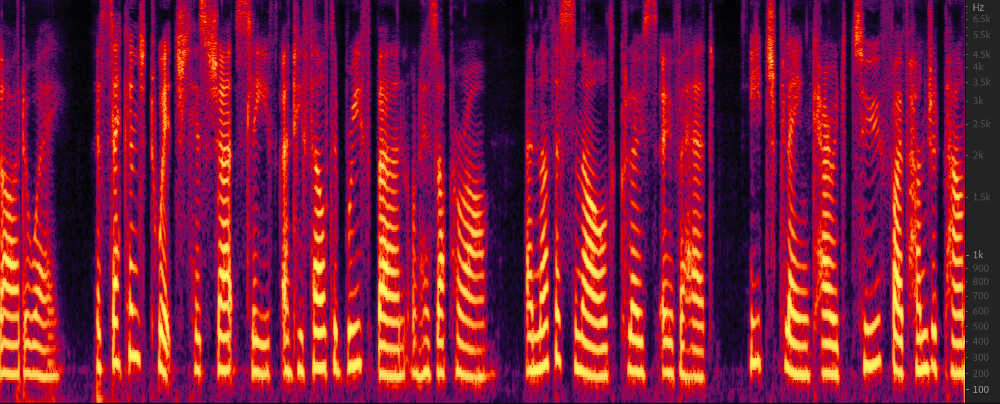** |
| <audio controls><source src="./data/no_reverb/example4/fullsubnet+.wav" type="audio/wav">Your browser does not support the audio element.</audio> |
|                          **Clean**                           |
| **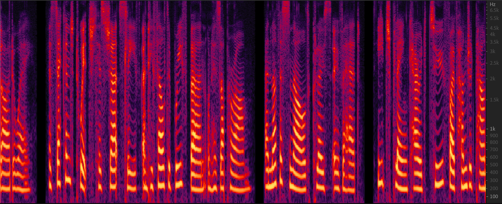** |
| <audio controls><source src="./data/no_reverb/example4/clean.wav" type="audio/wav">Your browser does not support the audio element.</audio> |

<h2 id = "7">With Reverberation</h2>

<h3 id = "8">case 1</h3>

|                          **case 1**                          |
| :----------------------------------------------------------: |
|                          **Noisy**                           |
| **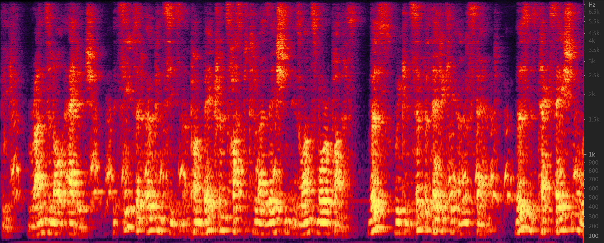** |
| <audio controls><source src="./data/with_reverb/example1/noisy.wav" type="audio/wav">Your browser does not support the audio element.</audio> |
|                        **FullSubNet**                        |
| **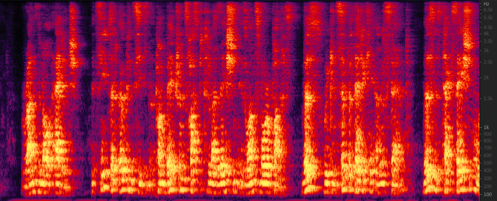** |
| <audio controls><source src="./data/with_reverb/example1/fullsubnet.wav" type="audio/wav">Your browser does not support the audio element.</audio> |
|                       **FullSubNet+**                        |
| **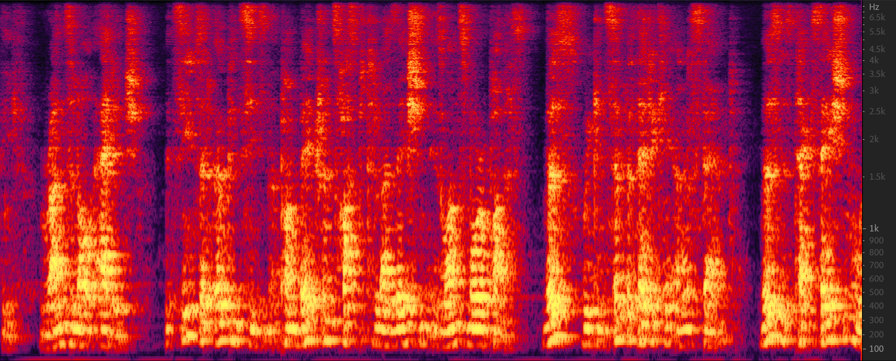** |
| <audio controls><source src="./data/with_reverb/example1/fullsubnet+.wav" type="audio/wav">Your browser does not support the audio element.</audio> |
|                          **Clean**                           |
| **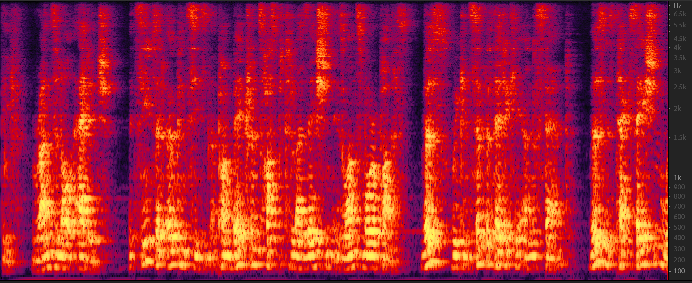** |
| <audio controls><source src="./data/with_reverb/example1/clean.wav" type="audio/wav">Your browser does not support the audio element.</audio> |

<h3 id = "9">case 2</h3>

|                          **case 2**                          |
| :----------------------------------------------------------: |
|                          **Noisy**                           |
| **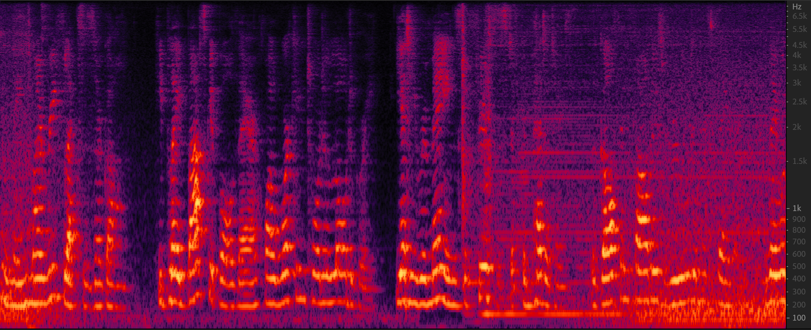** |
| <audio controls><source src="./data/with_reverb/example2/noisy.wav" type="audio/wav">Your browser does not support the audio element.</audio> |
|                        **FullSubNet**                        |
| **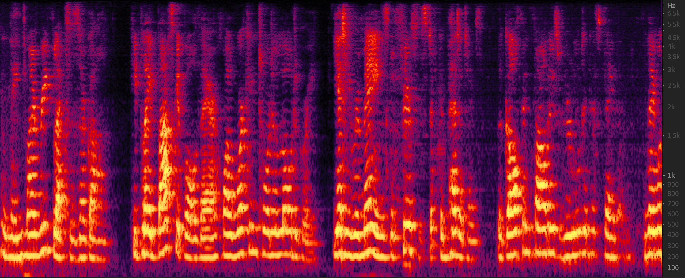** |
| <audio controls><source src="./data/with_reverb/example2/fullsubnet.wav" type="audio/wav">Your browser does not support the audio element.</audio> |
|                       **FullSubNet+**                        |
| **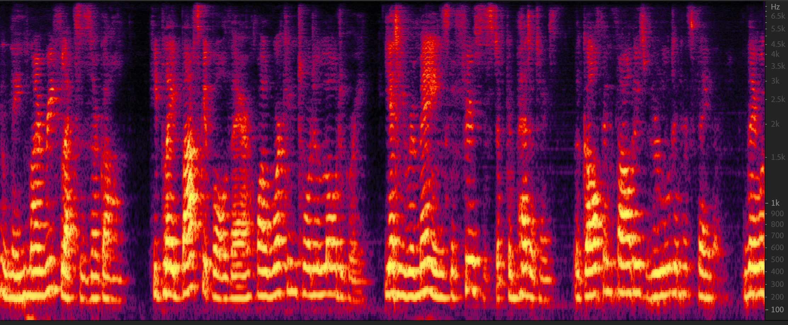** |
| <audio controls><source src="./data/with_reverb/example2/fullsubnet+.wav" type="audio/wav">Your browser does not support the audio element.</audio> |
|                          **Clean**                           |
| **** |
| <audio controls><source src="./data/with_reverb/example2/clean.wav" type="audio/wav">Your browser does not support the audio element.</audio> |

<h3 id = "10">case 3</h3>

|                          **case 3**                          |
| :----------------------------------------------------------: |
|                          **Noisy**                           |
| **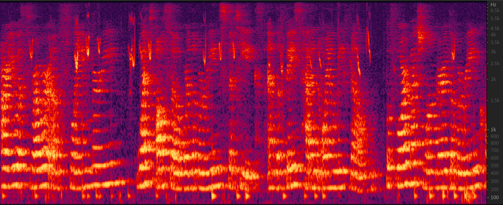** |
| <audio controls><source src="./data/with_reverb/example3/noisy.wav" type="audio/wav">Your browser does not support the audio element.</audio> |
|                        **FullSubNet**                        |
| **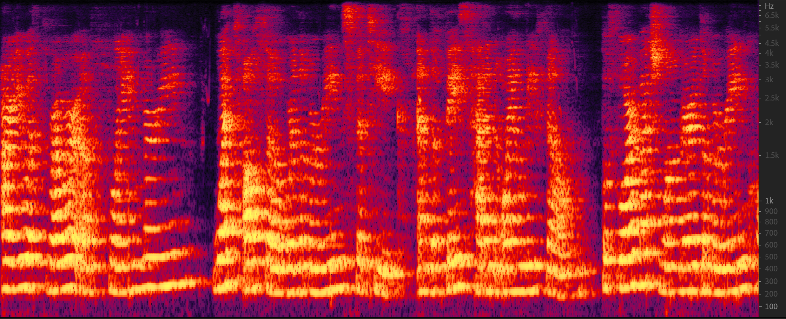** |
| <audio controls><source src="./data/with_reverb/example3/fullsubnet.wav" type="audio/wav">Your browser does not support the audio element.</audio> |
|                       **FullSubNet+**                        |
| **** |
| <audio controls><source src="./data/with_reverb/example3/fullsubnet+.wav" type="audio/wav">Your browser does not support the audio element.</audio> |
|                          **Clean**                           |
| **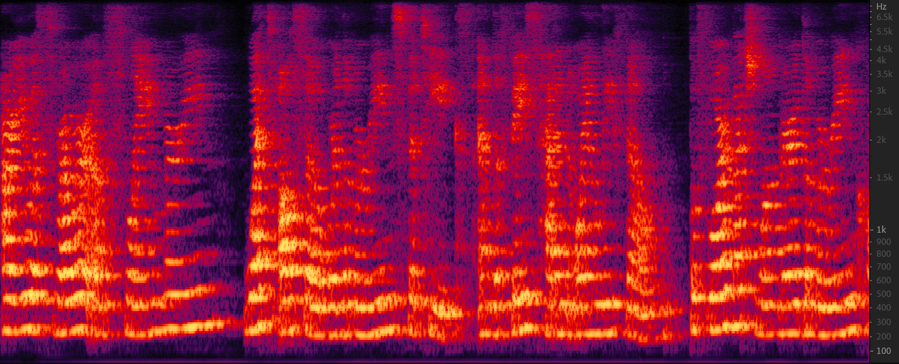** |
| <audio controls><source src="./data/with_reverb/example3/clean.wav" type="audio/wav">Your browser does not support the audio element.</audio> |

<h3 id = "11">case 4</h3>

|                          **case 4**                          |
| :----------------------------------------------------------: |
|                          **Noisy**                           |
| **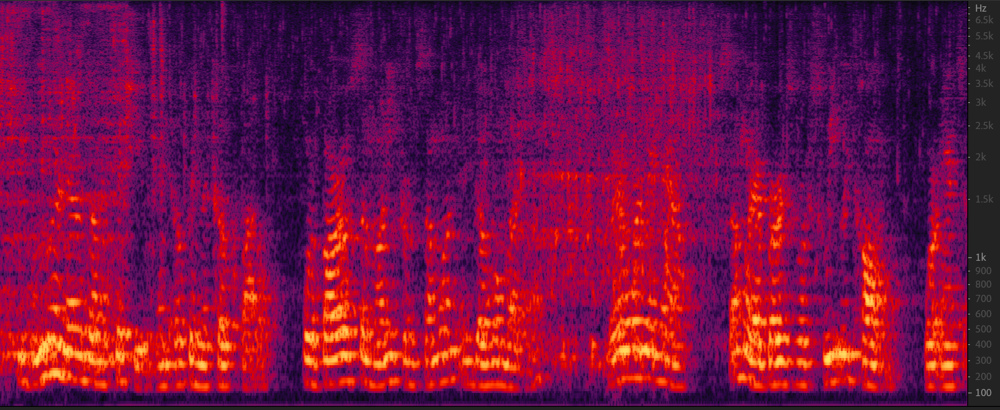** |
| <audio controls><source src="./data/with_reverb/example4/noisy.wav" type="audio/wav">Your browser does not support the audio element.</audio> |
|                        **FullSubNet**                        |
| **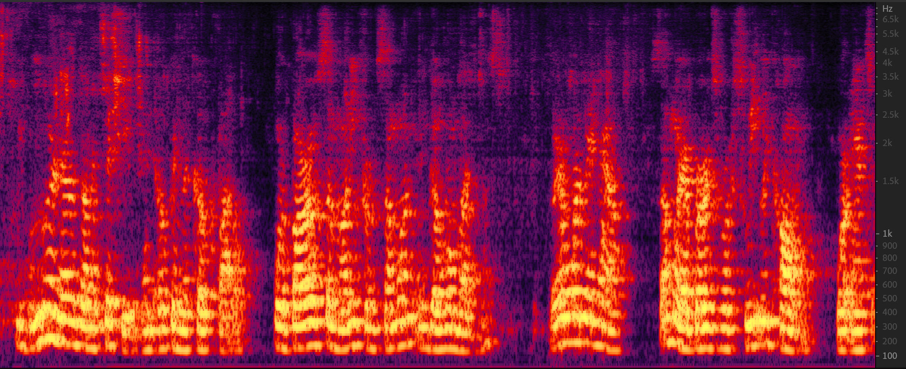** |
| <audio controls><source src="./data/with_reverb/example4/fullsubnet.wav" type="audio/wav">Your browser does not support the audio element.</audio> |
|                       **FullSubNet+**                        |
| **** |
| <audio controls><source src="./data/with_reverb/example4/fullsubnet+.wav" type="audio/wav">Your browser does not support the audio element.</audio> |
|                          **Clean**                           |
| **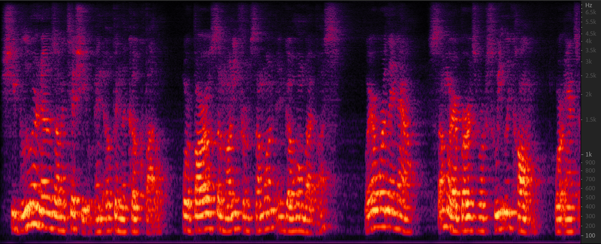** |
| <audio controls><source src="./data/with_reverb/example4/clean.wav" type="audio/wav">Your browser does not support the audio element.</audio> |

