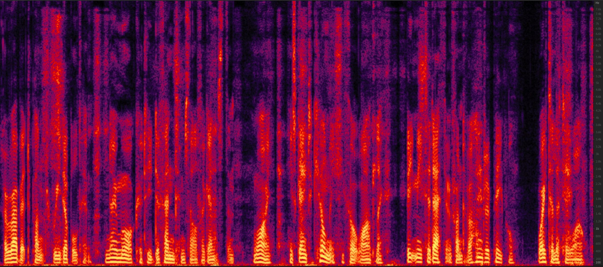
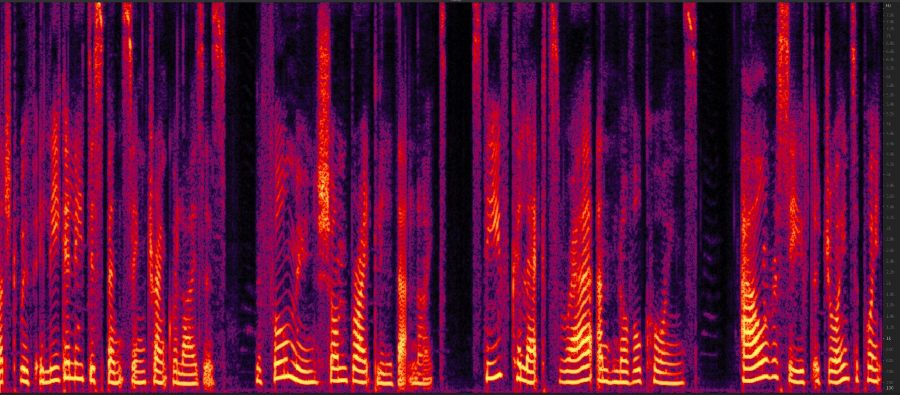
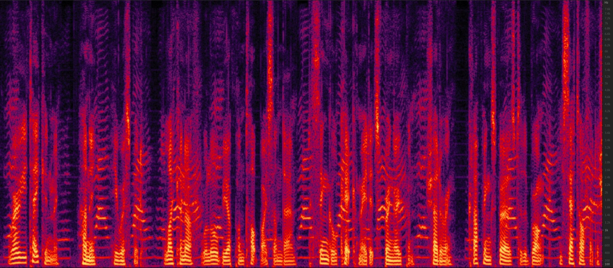
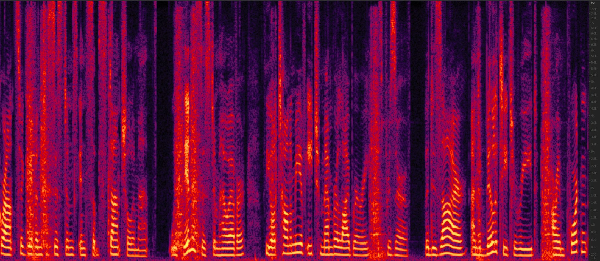
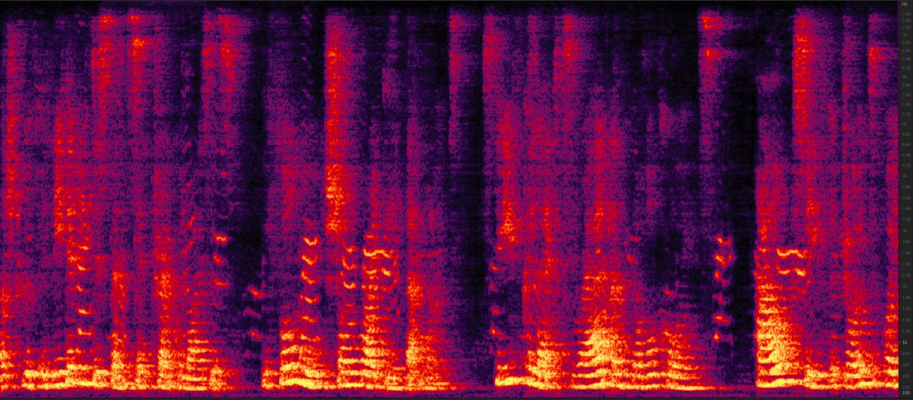
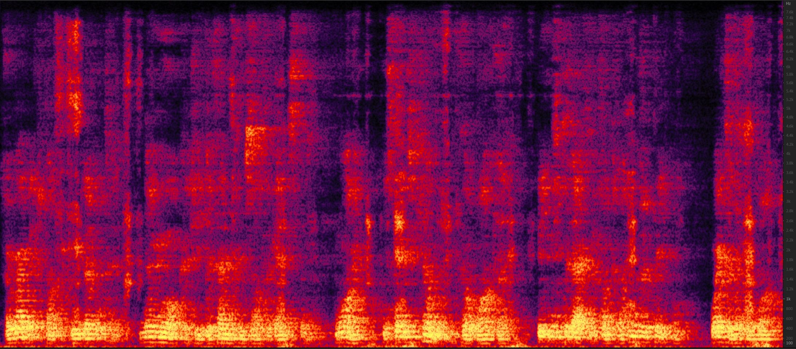
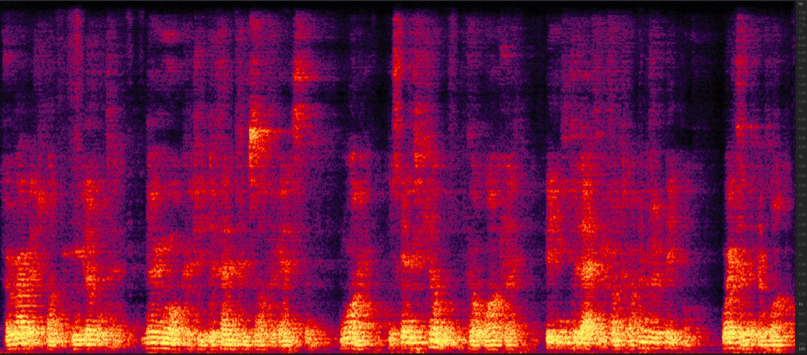

# Inter-SubNet: Speech Enhancement with Subband Interaction

### *Jun Chen, Wei Rao, Zilin Wang, Zhiyong Wu, Yannan Wang,  Tao Yu, Shidong Shang, Helen Meng*

<h2 id = "1">Abstract</h2>

## Without Reverberation

<h3 id = "3"> case 1</h3>

|                          **case 1**                          |                                                              |
| :----------------------------------------------------------: | :----------------------------------------------------------: |
| **Noisy**  <audio controls><source src="./data/no_reverb/example245/noisy.wav" type="audio/wav">Your browser does not support the audio element.</audio> | **Subband model**    <audio controls><source src="./data/no_reverb/example245/Subband_model.wav" type="audio/wav">Your browser does not support the audio element.</audio> |
|  |  |
| **Inter-SubNet**   <audio controls><source src="./data/no_reverb/example245/Inter_SubNet.wav" type="audio/wav">Your browser does not support the audio element.</audio> | **Clean**   <audio controls><source src="./data/no_reverb/example245/clean.wav" type="audio/wav">Your browser does not support the audio element.</audio> |
|  |  |

<h3 id = "3"> case 2</h3>

|                          **case 2**                          |                                                              |
| :----------------------------------------------------------: | :----------------------------------------------------------: |
| **Noisy**  <audio controls><source src="./data/no_reverb/example110/noisy.wav" type="audio/wav">Your browser does not support the audio element.</audio> | **Subband model**    <audio controls><source src="./data/no_reverb/example110/Subband_model.wav" type="audio/wav">Your browser does not support the audio element.</audio> |
|  |  |
| **Inter-SubNet**   <audio controls><source src="./data/no_reverb/example110/Inter_SubNet.wav" type="audio/wav">Your browser does not support the audio element.</audio> | **Clean**   <audio controls><source src="./data/no_reverb/example110/clean.wav" type="audio/wav">Your browser does not support the audio element.</audio> |
|  |  |

<h3 id = "3"> case 3</h3>

|                          **case 3**                          |                                                              |
| :----------------------------------------------------------: | :----------------------------------------------------------: |
| **Noisy**  <audio controls><source src="./data/no_reverb/example38/noisy.wav" type="audio/wav">Your browser does not support the audio element.</audio> | **Subband model**   <audio controls><source src="./data/no_reverb/example38/Subband_model.wav" type="audio/wav">Your browser does not support the audio element.</audio> |
|  |  |
| **Inter-SubNet**  <audio controls><source src="./data/no_reverb/example38/Inter_SubNet.wav" type="audio/wav">Your browser does not support the audio element.</audio> | **Clean**  <audio controls><source src="./data/no_reverb/example38/clean.wav" type="audio/wav">Your browser does not support the audio element.</audio> |
|  |  |

<h3 id = "3"> case 4</h3>

|                          **case 4**                          |                                                              |
| :----------------------------------------------------------: | :----------------------------------------------------------: |
| **Noisy**  <audio controls><source src="./data/no_reverb/example213/noisy.wav" type="audio/wav">Your browser does not support the audio element.</audio> | **Subband model**   <audio controls><source src="./data/no_reverb/example213/Subband_model.wav" type="audio/wav">Your browser does not support the audio element.</audio> |
|  |  |
| **Inter-SubNet**  <audio controls><source src="./data/no_reverb/example213/Inter_SubNet.wav" type="audio/wav">Your browser does not support the audio element.</audio> | **Clean**  <audio controls><source src="./data/no_reverb/example213/clean.wav" type="audio/wav">Your browser does not support the audio element.</audio> |
|  |  |

## With Reverberation

<h3 id = "3"> case 1</h3>

|                          **case 1**                          |                                                              |
| :----------------------------------------------------------: | :----------------------------------------------------------: |
| **Noisy**  <audio controls><source src="./data/with_reverb/example38/noisy.wav" type="audio/wav">Your browser does not support the audio element.</audio> | **Subband model**    <audio controls><source src="./data/with_reverb/example38/Subband_model.wav" type="audio/wav">Your browser does not support the audio element.</audio> |
|  |  |
| **Inter-SubNet**   <audio controls><source src="./data/with_reverb/example38/Inter_SubNet.wav" type="audio/wav">Your browser does not support the audio element.</audio> | **Clean**   <audio controls><source src="./data/with_reverb/example38/clean.wav" type="audio/wav">Your browser does not support the audio element.</audio> |
|  |  |

<h3 id = "3"> case 2</h3>

|                          **case 2**                          |                                                              |
| :----------------------------------------------------------: | :----------------------------------------------------------: |
| **Noisy**  <audio controls><source src="./data/with_reverb/example110/noisy.wav" type="audio/wav">Your browser does not support the audio element.</audio> | **Subband model**    <audio controls><source src="./data/with_reverb/example110/Subband_model.wav" type="audio/wav">Your browser does not support the audio element.</audio> |
|  |  |
| **Inter-SubNet**   <audio controls><source src="./data/with_reverb/example110/Inter_SubNet.wav" type="audio/wav">Your browser does not support the audio element.</audio> | **Clean**   <audio controls><source src="./data/with_reverb/example110/clean.wav" type="audio/wav">Your browser does not support the audio element.</audio> |
|  |  |

<h3 id = "3"> case 3</h3>

|                          **case 3**                          |                                                              |
| :----------------------------------------------------------: | :----------------------------------------------------------: |
| **Noisy**  <audio controls><source src="./data/with_reverb/example245/noisy.wav" type="audio/wav">Your browser does not support the audio element.</audio> | **Subband model**   <audio controls><source src="./data/with_reverb/example245/Subband_model.wav" type="audio/wav">Your browser does not support the audio element.</audio> |
|  |  |
| **Inter-SubNet**  <audio controls><source src="./data/with_reverb/example245/Inter_SubNet.wav" type="audio/wav">Your browser does not support the audio element.</audio> | **Clean**  <audio controls><source src="./data/with_reverb/example245/clean.wav" type="audio/wav">Your browser does not support the audio element.</audio> |
|  |  |

<h3 id = "3"> case 4</h3>

|                          **case 4**                          |                                                              |
| :----------------------------------------------------------: | :----------------------------------------------------------: |
| **Noisy**  <audio controls><source src="./data/with_reverb/example206/noisy.wav" type="audio/wav">Your browser does not support the audio element.</audio> | **Subband model**   <audio controls><source src="./data/with_reverb/example206/Subband_model.wav" type="audio/wav">Your browser does not support the audio element.</audio> |
|  |  |
| **Inter-SubNet**  <audio controls><source src="./data/with_reverb/example206/Inter_SubNet.wav" type="audio/wav">Your browser does not support the audio element.</audio> | **Clean**  <audio controls><source src="./data/with_reverb/example206/clean.wav" type="audio/wav">Your browser does not support the audio element.</audio> |
|  |  |
