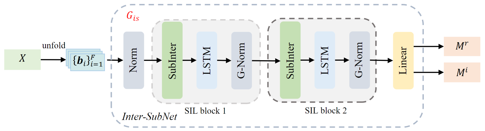
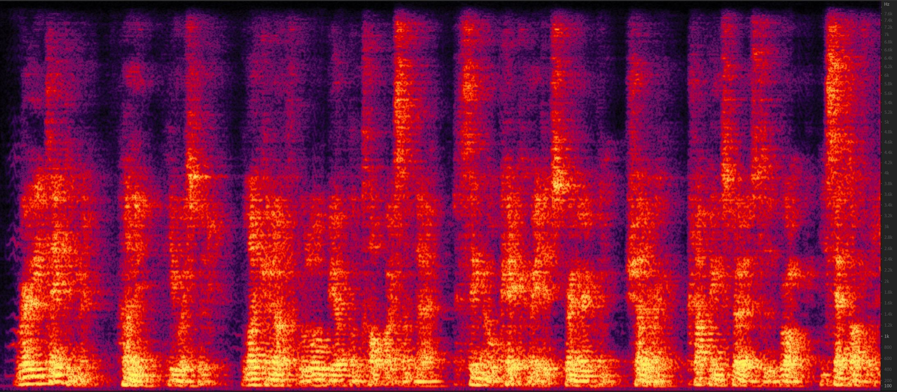
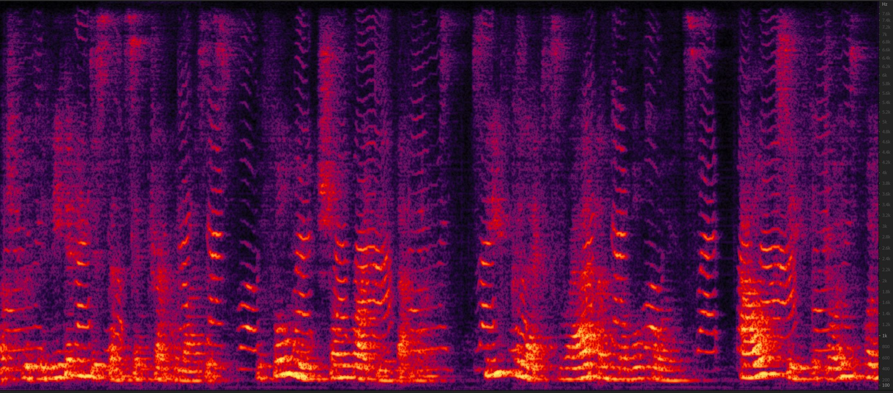
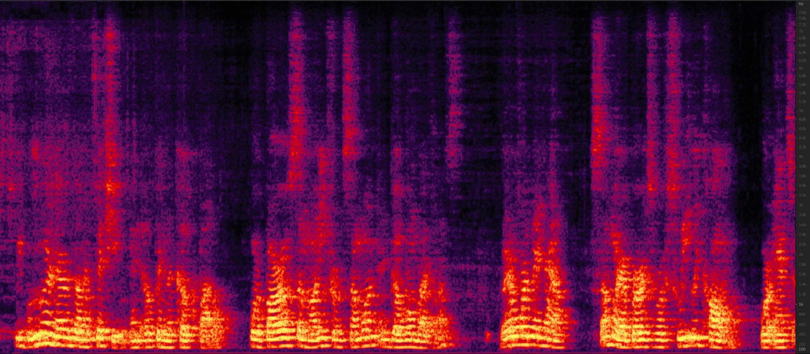

# Inter-SubNet: Speech Enhancement with Subband Interaction

### *Jun Chen, Wei Rao, Zilin Wang, Jiuxin Lin, Zhiyong Wu, Yannan Wang,  Shidong Shang, Helen Meng*

<h2 id = "1">Abstract</h2>

Subband-based approaches process subbands in parallel through the model with shared parameters to learn the commonality of local spectrums for noise reduction. In this way, they have achieved remarkable results with fewer parameters. However, in some complex environments, the lack of global spectral information has a negative impact on the performance of these subband-based approaches. To this end, this paper introduces the subband interaction as a new way to complement the subband model with the global spectral information such as cross-band dependencies and global spectral patterns, and proposes a new lightweight single-channel speech enhancement framework called Interactive Subband Network (Inter-SubNet). Experimental results on DNS Challenge - Interspeech 2021 dataset show that the proposed Inter-SubNet yields a significant improvement over the subband model and outperforms other state-of-the-art speech enhancement approaches, which demonstrate the effectiveness of subband interaction.

    
     
    
 Fig.1: The general schematic of the proposed Inter-SubNet, where "SIL block 1" and "SIL block 2" refer to the first and second SubInter-LSTM block respectively. The "G-norm" denotes group normalization. The Inter-SubNet \(G_{is}\) mainly consists of two stacked SIL blocks and one fully-connected layer. Taking the subband units \(\{\mathbf{b}_i\}_{i=1}^F\) as input, the model \(G_{is}\) generates the final output cIRM \(\mathbf{M}^{r}\) and \(\mathbf{M}^{i}\).
    

## Without Reverberation

<h3 id = "3"> case 1</h3>

|                          **case 1**                          |                                                              |
| :----------------------------------------------------------: | :----------------------------------------------------------: |
| **Noisy**  <audio controls><source src="./data/no_reverb/example245/noisy.wav" type="audio/wav">Your browser does not support the audio element.</audio> | **Subband model**    <audio controls><source src="./data/no_reverb/example245/Subband_model.wav" type="audio/wav">Your browser does not support the audio element.</audio> |
|  |  |
| **Inter-SubNet**   <audio controls><source src="./data/no_reverb/example245/Inter_SubNet.wav" type="audio/wav">Your browser does not support the audio element.</audio> | **Clean**   <audio controls><source src="./data/no_reverb/example245/clean.wav" type="audio/wav">Your browser does not support the audio element.</audio> |
|  |  |

<h3 id = "3"> case 2</h3>

|                          **case 2**                          |                                                              |
| :----------------------------------------------------------: | :----------------------------------------------------------: |
| **Noisy**  <audio controls><source src="./data/no_reverb/example110/noisy.wav" type="audio/wav">Your browser does not support the audio element.</audio> | **Subband model**    <audio controls><source src="./data/no_reverb/example110/Subband_model.wav" type="audio/wav">Your browser does not support the audio element.</audio> |
|  |  |
| **Inter-SubNet**   <audio controls><source src="./data/no_reverb/example110/Inter_SubNet.wav" type="audio/wav">Your browser does not support the audio element.</audio> | **Clean**   <audio controls><source src="./data/no_reverb/example110/clean.wav" type="audio/wav">Your browser does not support the audio element.</audio> |
|  |  |

<h3 id = "3"> case 3</h3>

|                          **case 3**                          |                                                              |
| :----------------------------------------------------------: | :----------------------------------------------------------: |
| **Noisy**   <audio controls><source src="./data/no_reverb/example38/noisy.wav" type="audio/wav">Your browser does not support the audio element.</audio> | **Subband model**    <audio controls><source src="./data/no_reverb/example38/Subband_model.wav" type="audio/wav">Your browser does not support the audio element.</audio> |
|  |  |
| **Inter-SubNet**   <audio controls><source src="./data/no_reverb/example38/Inter_SubNet.wav" type="audio/wav">Your browser does not support the audio element.</audio> | **Clean**   <audio controls><source src="./data/no_reverb/example38/clean.wav" type="audio/wav">Your browser does not support the audio element.</audio> |
|  |  |

<h3 id = "3"> case 4</h3>

|                          **case 4**                          |                                                              |
| :----------------------------------------------------------: | :----------------------------------------------------------: |
| **Noisy**   <audio controls><source src="./data/no_reverb/example213/noisy.wav" type="audio/wav">Your browser does not support the audio element.</audio> | **Subband model**   <audio controls><source src="./data/no_reverb/example213/Subband_model.wav" type="audio/wav">Your browser does not support the audio element.</audio> |
|  |  |
| **Inter-SubNet**   <audio controls><source src="./data/no_reverb/example213/Inter_SubNet.wav" type="audio/wav">Your browser does not support the audio element.</audio> | **Clean**   <audio controls><source src="./data/no_reverb/example213/clean.wav" type="audio/wav">Your browser does not support the audio element.</audio> |
|  |  |

## With Reverberation

<h3 id = "3"> case 1</h3>

|                          **case 1**                          |                                                              |
| :----------------------------------------------------------: | :----------------------------------------------------------: |
| **Noisy**  <audio controls><source src="./data/with_reverb/example38/noisy.wav" type="audio/wav">Your browser does not support the audio element.</audio> | **Subband model**    <audio controls><source src="./data/with_reverb/example38/Subband_model.wav" type="audio/wav">Your browser does not support the audio element.</audio> |
|  |  |
| **Inter-SubNet**   <audio controls><source src="./data/with_reverb/example38/Inter_SubNet.wav" type="audio/wav">Your browser does not support the audio element.</audio> | **Clean**   <audio controls><source src="./data/with_reverb/example38/clean.wav" type="audio/wav">Your browser does not support the audio element.</audio> |
|  |  |

<h3 id = "3"> case 2</h3>

|                          **case 2**                          |                                                              |
| :----------------------------------------------------------: | :----------------------------------------------------------: |
| **Noisy**  <audio controls><source src="./data/with_reverb/example110/noisy.wav" type="audio/wav">Your browser does not support the audio element.</audio> | **Subband model**    <audio controls><source src="./data/with_reverb/example110/Subband_model.wav" type="audio/wav">Your browser does not support the audio element.</audio> |
|  |  |
| **Inter-SubNet**   <audio controls><source src="./data/with_reverb/example110/Inter_SubNet.wav" type="audio/wav">Your browser does not support the audio element.</audio> | **Clean**   <audio controls><source src="./data/with_reverb/example110/clean.wav" type="audio/wav">Your browser does not support the audio element.</audio> |
|  |  |

<h3 id = "3"> case 3</h3>

|                          **case 3**                          |                                                              |
| :----------------------------------------------------------: | :----------------------------------------------------------: |
| **Noisy**   <audio controls><source src="./data/with_reverb/example245/noisy.wav" type="audio/wav">Your browser does not support the audio element.</audio> | **Subband model**    <audio controls><source src="./data/with_reverb/example245/Subband_model.wav" type="audio/wav">Your browser does not support the audio element.</audio> |
|  |  |
| **Inter-SubNet**   <audio controls><source src="./data/with_reverb/example245/Inter_SubNet.wav" type="audio/wav">Your browser does not support the audio element.</audio> | **Clean**   <audio controls><source src="./data/with_reverb/example245/clean.wav" type="audio/wav">Your browser does not support the audio element.</audio> |
|  |  |

<h3 id = "3"> case 4</h3>

|                          **case 4**                          |                                                              |
| :----------------------------------------------------------: | :----------------------------------------------------------: |
| **Noisy**   <audio controls><source src="./data/with_reverb/example206/noisy.wav" type="audio/wav">Your browser does not support the audio element.</audio> | **Subband model**    <audio controls><source src="./data/with_reverb/example206/Subband_model.wav" type="audio/wav">Your browser does not support the audio element.</audio> |
|  |  |
| **Inter-SubNet**   <audio controls><source src="./data/with_reverb/example206/Inter_SubNet.wav" type="audio/wav">Your browser does not support the audio element.</audio> | **Clean**   <audio controls><source src="./data/with_reverb/example206/clean.wav" type="audio/wav">Your browser does not support the audio element.</audio> |
|  |  |
